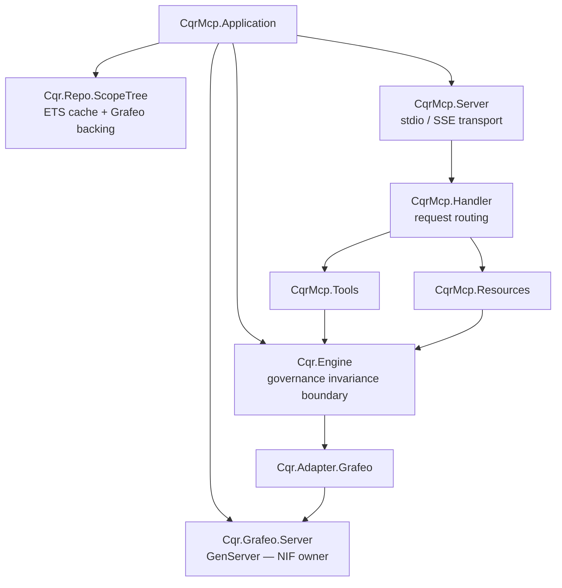
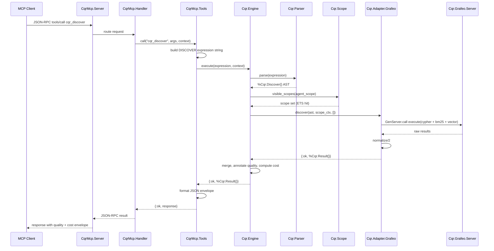

# Architecture

This document describes how CQR MCP Server is built. It targets the engineer who cloned the repo and wants a map of the system before reading source.

## 1. System Overview

The server is a single OS process — an Elixir/OTP application with Grafeo (pure-Rust graph database) embedded directly into the BEAM via a Rustler NIF. There is no separate database container, no network hop between engine and storage, and no external service required to start.

### Supervision tree



Everything under `CqrMcp.Application` is supervised. A Grafeo NIF crash restarts only the Grafeo server; an MCP transport failure does not take down the engine; the scope tree cache is rebuilt from backing storage on restart. This is the standard "let it crash" OTP discipline applied to a database-backed server.

### Request flow

A `cqr_discover` call from an MCP client traverses:



## 2. Grafeo Integration

Grafeo is a pure-Rust, embeddable graph database with support for LPG (Labeled Property Graphs) + RDF, Cypher + GQL query languages, HNSW vector search, BM25 full-text search, and ACID transactions with MVCC. The CQR MCP server embeds it via a Rustler NIF.

**NIF surface (intentionally narrow):**

- `new/1` — create or open a database
- `execute/2` — run a query string (Cypher, GQL, SQL/PGQ)
- `close/1` — tear down
- `health_check/0` — connectivity and version status

Everything else — query planning, adapter dispatch, scope resolution, quality annotation — stays in Elixir. The NIF surface stays narrow on purpose: fewer functions to keep safe across Rust/BEAM boundaries, fewer opportunities for dirty-scheduler issues, and a clean migration path if Grafeo is ever swapped for another embedded engine.

All query traffic is routed through `Cqr.Grafeo.Server`, a GenServer that owns the NIF handle and serializes access. Concurrent MCP requests produce a queue of `GenServer.call` messages rather than concurrent NIF invocations. Grafeo supports concurrent reads internally, but serializing at the BEAM boundary gives us one choke point for instrumentation, backpressure, and future pooling.

Grafeo runs in-memory by default. Pass `--persist` at startup for durable storage across restarts — the server opens or creates `~/.cqr/grafeo.grafeo` (or a custom path supplied after the flag) and skips the sample-data seeder. See `README.md` for the full flag reference.

## 3. Multi-Paradigm Query Composition

The architectural innovation in CQR is how a single DISCOVER invocation composes multiple query paradigms against a single embedded backend.

A DISCOVER against `entity:product:churn_rate` within `scope:company:product` executes four logical stages:

1. **Scope traversal (Cypher).** Resolve the set of accessible scope nodes starting from the agent's active scope — ancestors and descendants, siblings excluded. This produces the candidate set: every entity node reachable within governed boundaries.
2. **Full-text search (BM25).** If the DISCOVER anchor is a free-text search term rather than a typed entity reference, run BM25 over the candidate set's textual properties (name, description, tags).
3. **Vector similarity (HNSW).** Embeddings attached to entity descriptions rank candidates by semantic similarity to the anchor, constrained to the candidate set.
4. **Application-layer ranking (Elixir).** Post-process the combined result set — reputation weighting, relationship typing, direction tagging, confidence aggregation. A cosine-similarity gap in Grafeo v0.5 is worked around inline at this stage.

The critical design choice is the **ordering**: stage 1 runs first and constrains what stages 2–4 can see. This inverts the conventional RAG pipeline (vector search globally, then filter by ACL), and the inversion matters:

- **Security is real, not performative.** Out-of-scope entities never enter the candidate set. An agent cannot probe them via crafted embeddings or error-message leakage.
- **Result-set sizes are predictable.** Bounded by scope cardinality, not by top-k against a global corpus. Query cost scales with the agent's scope, not with total database size.
- **Compute efficiency on large corpora.** Vector similarity over a governed subset is orders of magnitude cheaper than over the full index.

## 4. Adapter Behaviour Contract

`Cqr.Adapter.Behaviour` defines the contract every storage backend implements:

```elixir
@callback resolve(expression, scope_context, opts)        :: {:ok, term} | {:error, term}
@callback discover(expression, scope_context, opts)       :: {:ok, term} | {:error, term}
@callback assert(expression, scope_context, opts)         :: {:ok, term} | {:error, term}
@callback trace(expression, scope_context, opts)          :: {:ok, term} | {:error, term}
@callback signal(expression, scope_context, opts)         :: {:ok, term} | {:error, term}
@callback refresh_check(expression, scope_context, opts)  :: {:ok, term} | {:error, term}
@callback normalize(raw_results, metadata)                :: term
@callback health_check()                                  :: :ok | {:error, term}
@callback capabilities()                                  :: [atom]
```

`assert/3`, `trace/3`, `signal/3`, and `refresh_check/3` are optional callbacks — backends that only support reads declare their capabilities accordingly and the engine planner skips them for operations they do not implement.

The engine's `Planner` inspects each adapter's `capabilities/0` and routes expressions only to adapters that can handle them. Multi-adapter deployments fan out concurrently via `Task.async_stream` with a 30-second timeout; results are merged with explicit conflict preservation — if two adapters return different values for the same entity, both are returned with source attribution rather than one being silently picked.

Grafeo is the reference implementation. The contract is deliberately small so that PostgreSQL/pgvector, Neo4j, Elasticsearch, Snowflake, and custom internal warehouses can be added without touching engine code. Adapter registration is a configuration change.

## 5. Scope Model

Scopes form a hierarchical tree (`scope:company → scope:company:product → scope:company:product:mobile`). Scope is a first-class part of query execution, not a post-retrieval filter.

### Visibility rules

`Cqr.Scope.visible_scopes/1` returns the set of scopes accessible from an agent's active scope:

- **Self** — the agent's own scope
- **Ancestors** — parent scopes up to the root, for fallback resolution
- **Descendants** — child scopes owned by this scope, for admin agents at higher levels
- **Siblings are excluded** — `scope:company:finance` cannot see `scope:company:engineering`

### Enforcement

Scope constraints are compiled into the query, not applied afterward. For Cypher this means the scope set becomes a `WHERE` clause on node labels before path expansion; for BM25 and HNSW it constrains the index scan. Out-of-scope entities return `not_found`, not `access_denied` — the agent cannot distinguish "this does not exist" from "this exists but is forbidden." This is **genuine invisibility**, and it matters: access-denied errors leak the existence of entities.

### ETS cache

The scope tree is loaded into ETS on startup for sub-millisecond lookups on the hot path. CERTIFY operations that modify the scope hierarchy invalidate the cache entry for the affected subtree and trigger a targeted rebuild. Full cache rebuilds are reserved for startup and explicit admin operations.

## 6. Quality Metadata Envelope

Every response from `Cqr.Engine.execute/2` returns a `%Cqr.Result{}` that includes a `%Cqr.Quality{}` envelope:

```elixir
%Cqr.Quality{
  freshness:    ~U[2026-04-10 09:12:00Z],
  confidence:   0.92,
  reputation:   0.87,
  owner:        "finance_team",
  lineage:      [...],
  certified_by: "cfo",
  certified_at: ~U[2026-03-14 16:00:00Z],
  provenance:   "grafeo:finance:q4_actuals"
}
```

The envelope is **mandatory and non-optional**. Fields that cannot be populated are set to `:unknown` and serialized as `null` — they are never silently dropped. An agent can always reason about whether it has enough information to trust a response, even when that information is "we do not know how fresh this is."

Errors also carry quality context. `%Cqr.Error{}` includes `suggestions`, `similar_entities`, `partial_results`, and `retry_guidance` — errors are cognitive inputs, not exceptions. An agent can read a `scope_access` error and reason over the returned list of visible scopes to self-correct without a second round-trip to the LLM.

## 7. Error Semantics

Errors are data, not exceptions. The engine never raises; every failure path returns `{:error, %Cqr.Error{}}`. Error codes include:

| Code | Meaning | Agent response |
|------|---------|----------------|
| `:parse_error` | Malformed CQR expression | Retry with corrected grammar |
| `:entity_not_found` | No matching entity in visible scopes | Use `similar_entities` suggestions |
| `:scope_access` | Scope is outside the agent's visible set | Re-query within `suggestions` |
| `:invalid_transition` | CERTIFY lifecycle violation | Check current status, choose valid next state |
| `:no_adapter` | No adapter supports this primitive | No retry — structural limit |
| `:adapter_timeout` | Adapter exceeded 30s budget | Retry with narrower scope or lower depth |

Because errors are structured data, an agent's system prompt can teach it to treat them as inputs. The `cqr://system_prompt` MCP resource does exactly that — it instructs the LLM to inspect error envelopes, use suggestions, and only escalate to the human when `retry_guidance` is empty.

## 8. Governance Invariance

`Cqr.Engine.execute/2` is the single boundary. Everything above it is a delivery concern (MCP, REST, direct call, future LiveView UI); everything below it is a storage concern (adapters, NIF, physical layout). Governance — scope validation, quality annotation, conflict preservation, cost accounting — lives in between and applies uniformly regardless of either. No delivery mechanism can bypass, weaken, or alter governance behavior.
